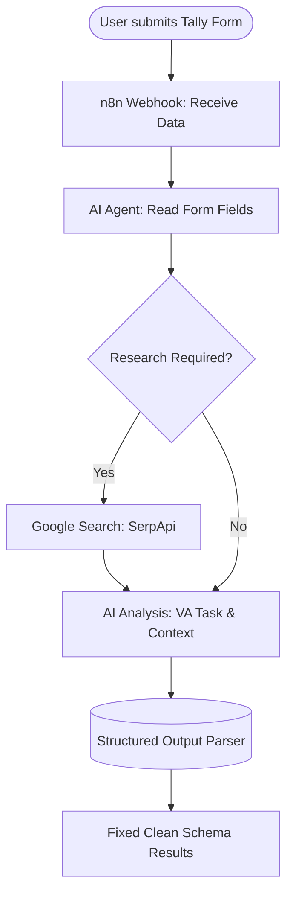
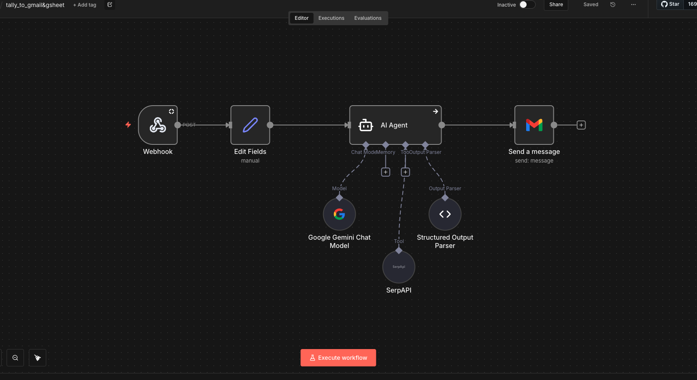

## Client Intake & Research Automation

Manually reviewing form submissions and researching clients is slow and inconsistent.

### Workflow Breakdown

### Output 
A structured AI-generated result including client summary, research points, and ready-to-use email content.

---
## Workflow Demo

---
## Screenshot of Workflow

